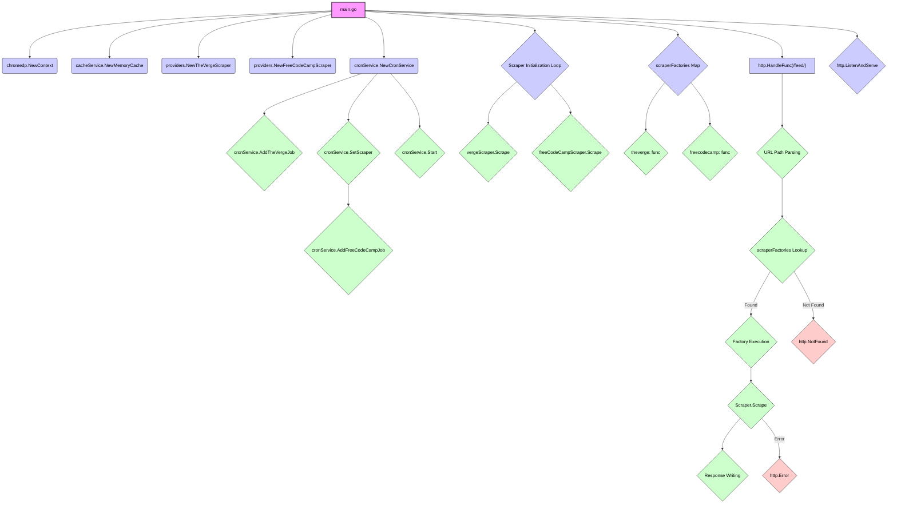

# RSS Feed generator

This is a simple RSS feed generator that uses the [chromedp](https://github.com/chromedp/chromedp) package to scrape the web and generate an RSS feed.

## Why

I use the RSS feeds generated by this server to provide content to my Telegram bot, which automatically subscribes to these feeds.

## Supported websites

- [The Verge](https://www.theverge.com/)
- [FreeCodeCamp](https://www.freecodecamp.org/)
- [AWS Blog](https://aws.amazon.com/blogs)
- [CSS Tricks](https://css-tricks.com/)

## How

